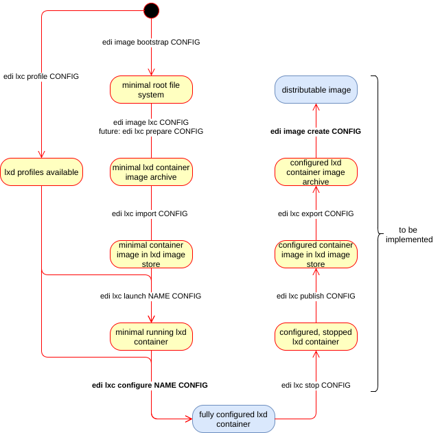

Command Pipeline
================

edi is designed to divide big tasks into small sub commands. Each sub command will
initiate the transition into a new state of available artifacts:

If the desired original state has not yet been reached, edi will make sure that all
necessary sub commands get executed to reach the desired state.

Example:

The following command will make sure - that after a successful execution - a fully
configured lxd container is available:

.. code:: bash

   sudo edi lxc configure NAME CONFIG

If the intermediate artifacts are to some degree not available, edi will execute
all required sub commands - if needed it will start with the `image bootstrap` sub command.

Please note that the intermediate artifacts are not checked if they are fully up to date.
If you want to make sure that all intermediate artifacts for a given configuration get recreated
then execute the following command:

.. code:: bash

   edi clean CONFIG

The above command will delete the previously generated artifacts. However, it will not delete named lxd
containers.

