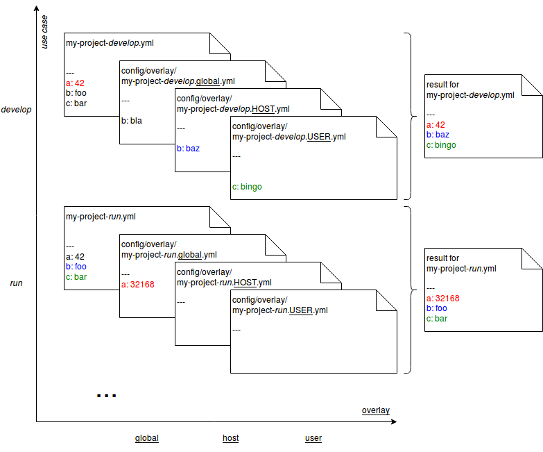

.. _overlays:

Overlays
========

As soon as a single :code:`edi` project configuration should support multiple use cases the use of overlays will
help to get rid of duplicate configuration code. When using overlays, it is a good practice to put most of the
configuration code into a single yaml file. In the example configuration used throughout the previous chapters this
is the file :code:`configuration/base/my-project.yml`. A use case like :code:`my-project-develop.yml` is then just
a symbolic link to this configuration file. The differentiation between the use cases happens in the :code:`global`
overlay (e.g. :code:`configuration/overlay/my-project-develop.global.yml`): :code:`edi` will initially load
the base configuration and then merge it with the :code:`global` overlay. The configuration done in
the :code:`global` overlay takes precedence over the configuration done in the base configuration.

:code:`edi` furthermore supports two additional overlays: The configuration can be further tuned per
:code:`host` (the overlay file shall then end with :code:`.$(hostname).yml`, e.g. :code:`.buildd.yml`)
and per :code:`user` (the overlay file shall then end with :code:`.$(id -un).yml`, e.g. :code:`.johndoe.yml`).
The :code:`user` overlay takes the highest precedence.

The following picture illustrates how yaml configuration files will get merged:

The merged configuration can be displayed using a command like:

.. code:: bash

   edi lxc configure --config my-dev-container my-project-develop.yml

The usage of overlays is optional and in any case it is not necessary to specify all possible overlays.
