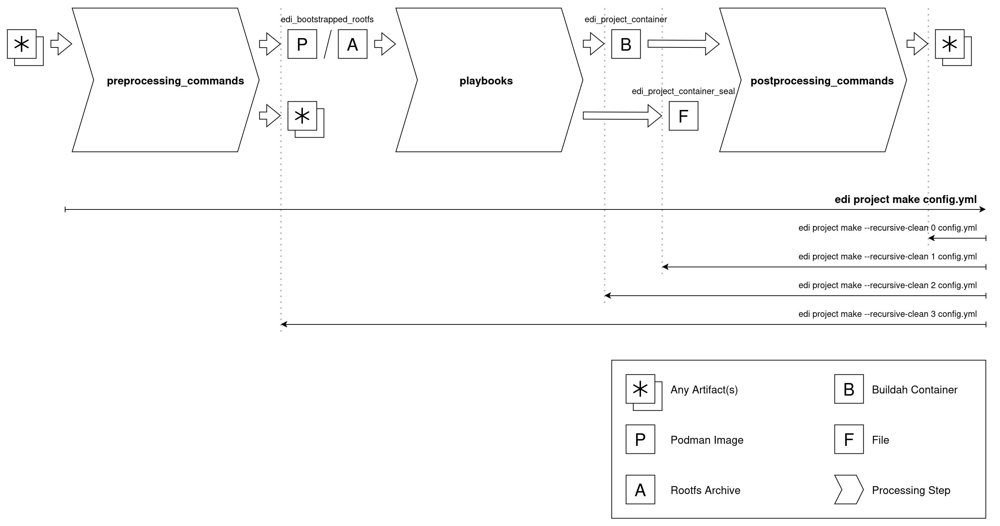

.. _rootless_workflow_v2:

Rootless Workflow
=================

.. note::
   This chapter covers the Buildah based workflow v2.

The edi v2 workflow is based on three processing steps:

#. The preprocessing_commands :code:`prepare` a root file system archive or Podman image that serves as the basis of
   the intermediate Buildah container we want to create. In the edi-pi configuration mmdebstrap is being used for this
   purpose and it creates a root file system from the packages taken from a Debian repository.
#. During the second processing step an Ansible playbook is being applied, and it :code:`configures` the initial root
   file system according to our needs. With workflow v2 it is preferred to have just one Ansible playbook.
   The playbook can be enriched with Ansible roles and collections_. In the edi-pi configuration the collection
   debian_setup_ gets pulled in as a git submodule.
#. The last processing step uses postprocessing_commands to turn the container root file system into whatever
   artifacts we need.

.. _collections: https://docs.ansible.com/ansible/latest/collections_guide/index.html
.. _debian_setup: https://github.com/lueschem/debian_setup

The command

.. code:: bash

   edi -v project make pi5.yml

used in the previous chapter makes sure that all three processing steps get executed. If all the artifacts expected
from the previous processing step are already present, then there is no need to execute that processing step again.
:code:`edi` will do that decision automatically.

.. note::
   Please be aware that the intermediate artifacts are not checked if they are fully up to date.
   If you want to make sure that all intermediate artifacts for a given configuration get recreated
   then execute the following command (it will delete all artifacts):

   .. code:: bash

      edi project clean pi5.yml

The heavy lifting is done using Ansible playbooks during the :code:`configure` processing step. In case something goes
wrong, it is possible to jump into the Buildah container and take a close look at the failed element:

   .. code:: bash

      john@u2404:~/edi-workspace/edi-pi$ buildah ps
      CONTAINER ID  BUILDER  IMAGE ID     IMAGE NAME                       CONTAINER NAME
      9a26c19b995a     *                  scratch                          edi-689892bd-429715a5
      john@u2404:~/edi-workspace/edi-pi$ buildah run edi-689892bd-429715a5 bash
      john@9a26c19b995a:/# <debugging within container>
      ...
      exit

To force a re-build of artifacts, they can be recursively cleaned:

   .. code:: bash

      edi -v project make --recursive-clean 1 pi5.yml

The :code:`--recursive-clean 1` is especially helpful as it does not delete the Buildah container artifact. A
subsequent :code:`edi -v project make pi5.yml` will then not have to re-build and re-configure the entire container.
Instead it will use the existing one. The assumption here is that the Ansible playbook is idempotent and can be
re-applied to the same Buildah container. If this is not the case e.g. due to a modification, the container can also
get erased using :code:`edi -v project make --recursive-clean 2 pi5.yml`.

In case the playbook fails at a certain step, a retry can be accelerated by directly jumping to the affected task:

   .. code:: bash

      edi -v --start-at-task "Install packages that are essential for running on bare metal." project make pi5.yml

.. _edi-pi: https://github.com/lueschem/edi-pi